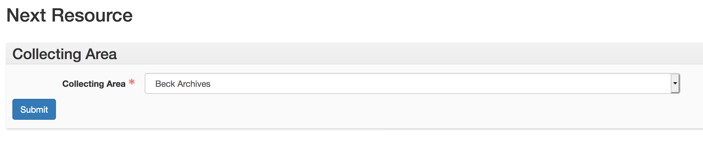
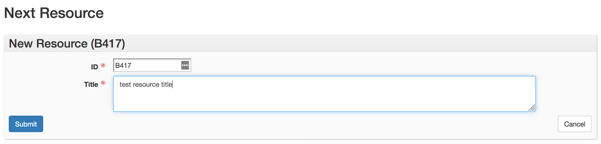

# Next Resource

This plugin generates the next collection call number in a sequence for the collecting area provided by a user, then provides a form where the user may provide a collection title. This process creates a stub resource record in the database, where the user may then provide additional information about the collection being processed.

The University of Denver assigns identifiers (or call numbers) to its archival collections based on the order in which they are added to one of our five main collecting areas:

* Beck Archives (local call numbers beginning with B)
* Carson Brierly Giffin Dance Library (local call numbers beginning with D)
* University Archives (local call numbers beginning with U)
* Special Collections manuscripts (local call numbers beginning with M)
* Digital collections of Library of Congress-classified bibliographic resources from the University Libraries Penrose Collection (local call numbers beginning with P)

The numbering schema is the collecting area indicator, followed by a zero-padded three-digit number identifying its order in the sequence. For example, "B005" (the National Asthma Center records) indicates that it is the fifth collection added to the Beck Archives.

## How the plugin works

The plugin contains a [custom API call](https://github.com/duspeccoll/next_resource/blob/master/backend/controllers/next_resource.rb) that takes as input the collecting area to which a resource should be added. It then gets the list of all resources in the database, builds an array of just those resources within the provided collecting area, and checks to see what the last number in the sequence is. The API adds one to that number in order to generate the resource ID it then returns.

In the frontend, a user selects the collecting area to which a resource belongs from a drop-down list:

Upon clicking the "Submit" button, a second form is presented, containing the resource identifier generated by the plugin. The user may then enter a title for the resource:

Once the title is entered, clicking "Submit" will generate a new resource record with the provided identifier and title. The user may then provide any additional metadata required to fully describe the resource, in line with the ArchivesSpace and local guidelines for resources. Clicking "Cancel" will return the user to the plugin index page.
